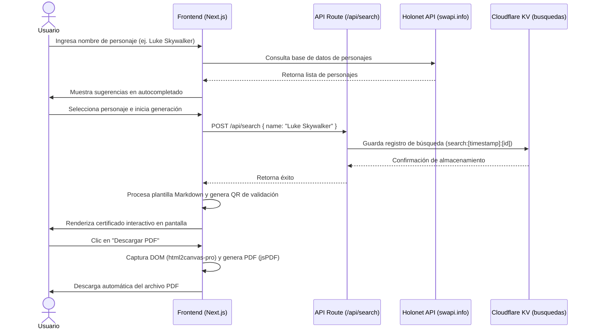

# 🚀 Registro Galáctico — Generador de Certificados de Star Wars

Este proyecto es una herramienta web interactiva construida sobre **Next.js** y **Cloudflare Workers**. Permite buscar personajes de Star Wars a través de la Holonet (utilizando una API pública), generar una ficha técnica/certificado personalizado en formato Markdown con código QR de verificación incorporado y descargarlo como un documento **PDF** con diseño profesional.

El proyecto fue desarrollado, depurado y desplegado de extremo a extremo en colaboración con la inteligencia artificial **Antigravity de Google DeepMind**.

---

## 🎯 Objetivo de la Aplicación
1. **Búsqueda Avanzada**: Buscar personajes de la saga de Star Wars mediante autocompletado interactivo.
2. **Consumo de API**: Conectar con la base de datos galáctica de `https://swapi.info/api/people`.
3. **Procesamiento de Plantillas**: Reemplazar placeholders en una plantilla Markdown base (`{{name}}`, `{{gender}}`, etc.) con datos en tiempo real.
4. **Historial en base de datos KV**: Registrar y persistir las búsquedas realizadas en una base de datos distribuida en el Edge (**Cloudflare Workers KV**).
5. **Generación de PDF y Código QR**: Generar un código QR de validación dinámico e incrustarlo en una plantilla A4 estilizada, permitiendo al usuario descargar un PDF de alta calidad que conserve los estilos modernos.

---

## 🛠️ Stack Tecnológico
* **Core**: Next.js 15.4.11 (React 19) & TypeScript.
* **Estilos**: Tailwind CSS v4 (con soporte para el espacio de color moderno `oklch`).
* **Base de Datos**: Cloudflare Workers KV (`busquedas`).
* **Generación de PDF**: `html2canvas-pro` (para soporte de renderizado `oklch`) + `jspdf` (para generación del archivo).
* **Renderizado Markdown**: `react-markdown`.
* **Servidor e Infraestructura**: Cloudflare Workers (con soporte de Workers Assets).

---

## 🗺️ Secuencia del Proceso de Usuario


---

## 🔧 Secuencia de Pasos de Desarrollo (Log de Antigravity)

### Paso 1: Inicialización y Estructura
* Configuración del entorno Next.js y definición del flujo de componentes principales.
* Creación del componente de búsqueda [SearchForm.tsx](file:///Users/hvega/Documents/PERSONAL/DEV/labiadev/repo-1/src/app/components/SearchForm.tsx) con estados de carga (utilizando una animación personalizada de un cargador BB-8) y manejo de errores para casos donde el personaje no exista.

### Paso 2: Endpoint de Registro en KV
* Creación de la API Route [route.ts](file:///Users/hvega/Documents/PERSONAL/DEV/labiadev/repo-1/src/app/api/search/route.ts).
* Se programó la lógica para acceder de forma segura a los bindings de Cloudflare Workers (`env.busquedas`) y registrar la marca de tiempo y el nombre del personaje buscado, estructurando las claves como `search:[timestamp]:[random_id]`.

### Paso 3: Diseño del Certificado y Renderizado de Markdown
* Diseño de una plantilla oficial en [markdownTemplate.ts](file:///Users/hvega/Documents/PERSONAL/DEV/labiadev/repo-1/src/app/utils/markdownTemplate.ts).
* Implementación del componente de visualización e impresión [CertificatePreview.tsx](file:///Users/hvega/Documents/PERSONAL/DEV/labiadev/repo-1/src/app/components/CertificatePreview.tsx).

---

## 🪲 Bugs Encontrados y Soluciones Aplicadas

Durante la construcción y el despliegue del proyecto, surgieron varios retos técnicos que fueron resueltos de forma inteligente:

### 1. Incompatibilidad de Comando de Despliegue (`Wrangler Pages` vs `Workers`)
* **Bug**: El entorno de despliegue ejecutaba `npx wrangler deploy` (diseñado para Workers), pero la configuración del proyecto en `wrangler.toml` definía un proyecto de Cloudflare Pages (`pages_build_output_dir`), provocando un error fatal por falta de un punto de entrada de Workers.
* **Solución**: Reconfiguramos [wrangler.toml](file:///Users/hvega/Documents/PERSONAL/DEV/labiadev/repo-1/wrangler.toml) para transformarlo en un proyecto de **Workers con Assets** (la arquitectura moderna de Cloudflare para Workers):
  ```toml
  main = ".vercel/output/static/_worker.js/index.js"
  
  [assets]
  directory = ".vercel/output/static"
  binding = "ASSETS"
  ```

### 2. Alerta de Seguridad al Subir Código del Servidor como Assets
* **Bug**: Wrangler detectaba la carpeta `_worker.js` dentro del directorio de assets `.vercel/output/static` e interrumpía el despliegue para evitar que el código lógico del servidor se expusiera públicamente en internet.
* **Solución**: Creamos el archivo [public/.assetsignore](file:///Users/hvega/Documents/PERSONAL/DEV/labiadev/repo-1/public/.assetsignore) conteniendo `_worker.js`. Next.js lo copia automáticamente al compilar, indicando a Wrangler que ignore esa carpeta para las subidas estáticas públicas, manteniendo el código del servidor privado y seguro.

### 3. Ruido de ESLint en Archivos Compilados
* **Bug**: Al ejecutar `npm run lint`, el linter de Next.js escaneaba los archivos de construcción minificados dentro de `.next/` y `.vercel/`, reportando más de 16,000 advertencias y errores irrelevantes que rompían la integración continua (CI).
* **Solución**: Modificamos [eslint.config.mjs](file:///Users/hvega/Documents/PERSONAL/DEV/labiadev/repo-1/eslint.config.mjs) para incluir una configuración de exclusión explícita usando el formato Flat Config:
  ```javascript
  {
    ignores: [
      ".next/**/*",
      ".vercel/**/*",
      "out/**/*",
      "build/**/*",
    ]
  }
  ```

### 4. Error al Generar PDF con Colores `oklch()` de Tailwind CSS v4
* **Bug**: Tailwind CSS v4 compila los estilos usando la función de color `oklch()`. Al hacer clic en descargar PDF, la librería tradicional `html2pdf.js` (a través de `html2canvas`) fallaba con el error: `Attempting to parse an unsupported color function "oklch"`.
* **Solución**:
  1. Desinstalamos `html2pdf.js` y en su lugar instalamos **`html2canvas-pro`** (que soporta de forma nativa funciones de color modernas como `oklch` y `oklab`) y **`jspdf`**.
  2. Modificamos [CertificatePreview.tsx](file:///Users/hvega/Documents/PERSONAL/DEV/labiadev/repo-1/src/app/components/CertificatePreview.tsx) para realizar las importaciones dinámicas directamente y ejecutar la renderización de manera nativa:
     ```typescript
     const html2canvasModule = await import('html2canvas-pro');
     const html2canvas = html2canvasModule.default || html2canvasModule;
     const { jsPDF } = await import('jspdf');

     const canvas = await html2canvas(element, { scale: 2.5, useCORS: true, backgroundColor: '#FFFFFF' });
     const imgData = canvas.toDataURL('image/jpeg', 0.98);
     const pdf = new jsPDF({ orientation: 'portrait', unit: 'mm', format: 'a4' });
     pdf.addImage(imgData, 'JPEG', 0, 0, 210, (canvas.height * 210) / canvas.width);
     pdf.save(`Certificado.pdf`);
     ```

---

## 🧪 Pruebas Finales y Verificación
Todas las etapas fueron probadas exitosamente:
1. **Linter Limpio**: `npm run lint` finaliza en menos de 2 segundos sin problemas.
2. **Build de Producción**: `npm run build` compila correctamente el bundle de Next.js.
3. **Build de Edge**: `npm run pages:build` genera exitosamente la estructura adaptada de Cloudflare en `.vercel/output/static`.
4. **Despliegue Exitoso**: El comando `npx wrangler deploy` sincroniza los recursos con Cloudflare sin advertencias de configuración remota discrepante.

---

## 🌍 Ejecución Local y Despliegue

### 1. Requisitos previos
Instalar dependencias del proyecto:
```bash
npm install
```

### 2. Levantar el Servidor de Desarrollo
```bash
npm run dev
```

### 3. Compilar para Cloudflare Workers
Genera la carpeta `.vercel/output/static` con la Worker y los recursos optimizados:
```bash
npm run pages:build
```

### 4. Desplegar en Producción
```bash
npx wrangler deploy
```

---

## 🔗 Producción
La aplicación se encuentra activa y disponible en su dominio personalizado:
👉 **[starwars.esign.company](https://starwars.esign.company)**
